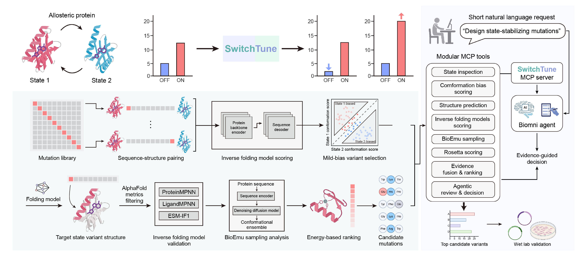

# SwitchTune

## An agentic framework for state-specific mutation design of conformational-switching proteins

SwitchTune is a research-oriented agentic framework for designing mutations that stabilize a desired conformational state of allosteric and conformationally switching proteins while preserving the underlying state-switching behavior.

The framework combines a Biomni-based scientific agent with modular MCP tools and a staged computational workflow. A short natural-language design request can be translated into a traceable sequence of structure-aware screening, model-based validation, molecular simulation, physics-based scoring, and evidence-guided candidate selection.

## What SwitchTune addresses

Conformational-switching proteins are difficult to engineer because a sequence-only model may favor the wrong state, over-stabilize one state, or produce mutations that are not compatible with the target structure. SwitchTune addresses this by explicitly representing:

- target and reference conformational states;
- state-specific structural templates;
- intermediate quality-control gates;
- multiple complementary sequence, structure, dynamics, and energy measurements;
- agent decisions with recorded evidence and reproducible workflow state.

## Workflow

1. Parse a natural-language design request.
2. Inspect target/reference structures and define the mutation region.
3. Generate a saturation mutation library.
4. Score state-specific conformational bias and select moderate-bias candidates.
5. Predict mutant structures with target-state template constraints.
6. Filter structures using confidence, local/global pLDDT, PAE, and target-state similarity.
7. Validate sequence-structure compatibility with inverse-folding models.
8. Sample conformational ensembles with BioEmu.
9. Evaluate local structural energetics with Rosetta.
10. Merge evidence and produce a ranked, auditable candidate shortlist.

## Agent architecture

SwitchTune uses:

- **Biomni** as the scientific agent runtime;
- **MCP** to expose modular domain tools;
- **LangChain/LangGraph-compatible orchestration patterns** for tool routing, checkpoints, state transitions, and resumable execution;
- **manifests and decision logs** to record inputs, outputs, candidate counts, QC status, and decision rationale;
- **guarded execution** to prevent accidental repetition of expensive jobs and to separate planning from external computation.

The MCP toolchain covers project setup, state inspection, mutation-library generation, conformation-bias scoring, structure prediction and QC, inverse folding, BioEmu sampling, Rosetta scoring, evidence fusion, and agentic review.

## Computational components

Depending on the protein system and available resources, SwitchTune can integrate:

- LigandMPNN or ProteinMPNN for conformation-bias and sequence-structure scoring;
- Boltz-2 NIM or other structure-prediction backends with target-state templates;
- pLDDT and PAE-based structural quality control;
- ESM-IF1, ProteinMPNN, and LigandMPNN for inverse-folding compatibility;
- BioEmu for conformational ensemble sampling;
- Rosetta for physics-based energy evaluation.

The framework is designed to keep these components replaceable. Individual tools can be enabled, disabled, or substituted without changing the high-level workflow logic.

## Current repository scope

This initial public repository contains project documentation and the conceptual workflow figure. The implementation and deployment-specific configuration will be released separately after removing local paths, credentials, generated runs, private logs, and machine-specific dependencies.

## Reproducibility and security

Do not commit:

- API keys or access tokens;
- local absolute paths;
- generated `SwitchTune_runs` directories;
- private logs or unpublished experimental data;
- structure files whose redistribution is not permitted;
- model checkpoints or other large cached artifacts.

Use environment variables and local configuration files for credentials and external tool locations.

## Project status

SwitchTune is an actively developed research prototype. The workflow has been validated on a CheY two-state design task and is being extended toward larger-scale agentic evidence analysis and experimental design support.

## 中文简介

SwitchTune 是一个面向变构蛋白和构象开关蛋白的自然语言驱动智能体框架，用于设计稳定目标构象、同时尽量保留构象切换能力的突变体。系统以 Biomni 为智能体底座，通过模块化 MCP tools 串联构象偏置打分、模板约束结构预测、pLDDT/PAE 质控、逆折叠模型验证、BioEmu 构象采样、Rosetta 能量评估和多证据候选排序。

当前公开仓库首先提供项目说明和 workflow 模式图；代码、运行配置和实验数据将在完成脱敏、依赖整理和发布许可确认后逐步加入。

## Contact and contributions

Issues and discussions are welcome after the first implementation release. Please do not upload credentials, private datasets, or unpublished experimental results to the repository.
